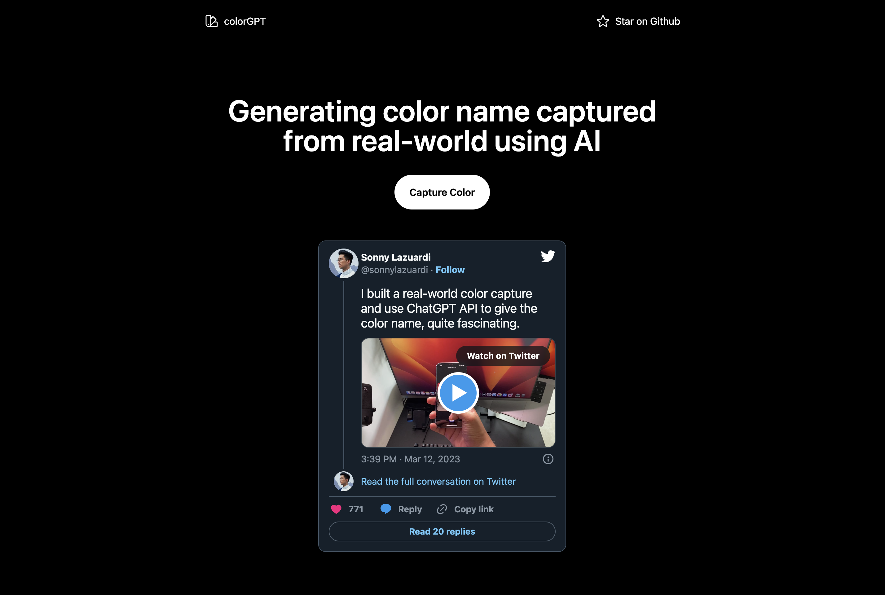

# colorGPT

[](https://twitter.com/sonnylazuardi/status/1634821365596299264)

## How it works

It uses ChatGPT API to generate color name from color hex. By using web video API `navigator.getUserMedia`, we can capture color from real-world in real-time.

## Running Locally

Cloning the repository the local machine.
```
git clone https://github.com/sonnylazuardi/colorgpt
```

Creating a account on OpenAI to get an API key.
Go to https://platform.openai.com to make an account.
Copy your API Key and paste in the app.

Installing the dependencies.

```
pnpm i
```

### Running the application.
Then, run the application in the command line and it will be available at http://localhost:3000.

```
pnpm dev
```

## Deploy your own

Deploy the example using [Vercel](https://vercel.com?utm_source=github&utm_medium=readme&utm_campaign=next-example) or preview live with [StackBlitz](https://stackblitz.com/github/sonnylazuardi/colorgpt)

[](https://vercel.com/new/git/external?repository-url=https://github.com/sonnylazuardi/colorgpt&project-name=colorgpt&repository-name=colorgpt)

